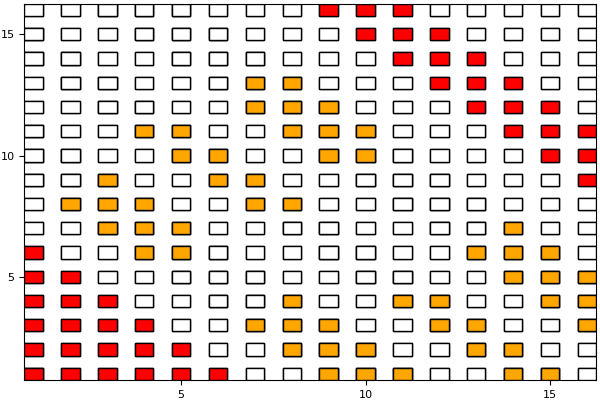

# README #

RACE-Recursive Algebraic Coloring Engine is a graph coloring library that helps in parallelization of sparse matrix kernels having distance-k (k>=1)
dependencies.RACE uses a recursive level based method for coloring.

### FEATURES ###

* Hardware friendly
* Solve Distance-1 & Distance-2 dependencies kernels
* Supports pre-processing and processing phase
* Easy parallelisation, user needs to just supply serial kernel
* Support for CRS and SELL-C-sigma data formats
* Self-pinning

### How to build RACE? ###

* git clone christiealappatt@bitbucket.org:christiealappatt/race.git
* cd race && mkdir build && cd build
* CC=$(C\_COMPILER) CXX=$(CXX\_COMPILER) cmake ..
* Configure the library using ccmake . (if needed)
* make
* make install
* Library Dependencies : hwloc (will be cloned and installed if not found)
* Use $(RACE\_LIB)/RACE\_LFLAGS.sh or use CMAKE find\_package to get the proper linking flags for the library

### Want to try RACE? ###
RACE provides examples to illustrate the usage and easiness of using the RACE library. To try it out:

* cd race/example
* mkdir build && cd build
* CC=$(C\_COMPILER) CXX=$(CXX\_COMPILER) cmake .. -DRACE\_DIR=$(RACE\_LIB)
* make
* To run: ./race -m [matrix file] -c [nthreads]
* To get other options use: ./race -h

### RACE working ###

### Who do I talk to? ###

* Christie Louis Alappat <christie.alappat@fau.de>