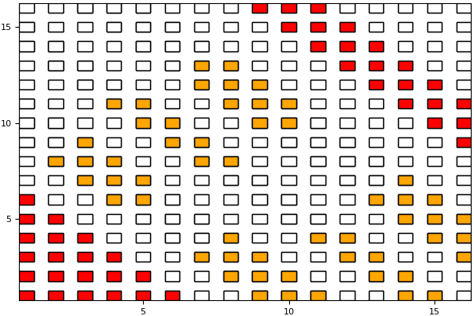
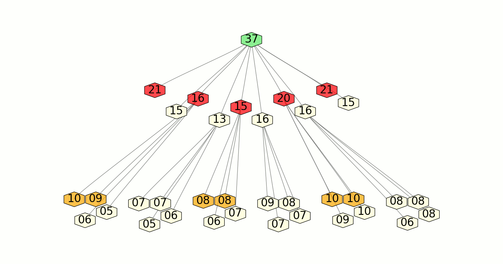

# README #

RACE-Recursive Algebraic Coloring Engine is a graph coloring library that helps in parallelization of sparse matrix kernels having distance-k (k>=1)
dependencies.RACE uses a recursive level based method for coloring.

### FEATURES ###

* Hardware friendly
* Solve Distance-1 & Distance-2 dependencies kernels
* Supports pre-processing and processing phase
* Easy parallelisation, user needs to just supply serial kernel
* Support for CRS and SELL-C-sigma data formats
* Self-pinning

### How to build RACE? ###

* git clone git@bitbucket.org:essex/race.git
* cd race && mkdir build && cd build
* CC=$(C\_COMPILER) CXX=$(CXX\_COMPILER) cmake ..
* Configure the library using ccmake . (if needed)
* make
* make install
* Library Dependencies : hwloc (will be cloned and installed if not found)
* Use CMAKE find\_package to get the proper linking flags for the library

### Want to try RACE? ###
RACE provides examples to illustrate the usage and easiness of using the RACE library. To try it out:

* cd race/example
* mkdir build && cd build
* CC=$(C\_COMPILER) CXX=$(CXX\_COMPILER) cmake .. -DRACE\_DIR=$(RACE\_LIB)
* make
* To run: ./race -m [matrix file] -c [nthreads]
* To get other options use: ./race -h

### RACE working ###

### Citing RACE ###

If you are using RACE please use the following reference:

* C. L. Alappat, G. Hager, O. Schenk, J. Thies, A. Basermann, A. R. Bishop, H. Fehske, and G. Wellein: 
  A Recursive Algebraic Coloring Technique for Hardware-Efficient Symmetric Sparse Matrix-Vector Multiplication. Submitted to ACM TOPC. Preprint: [arXiv:1907.06487](https://arxiv.org/abs/1907.06487)
  
### Further Reading ###

* A poster on RACE was presented at SC'18. The poster and abstract can be found [here](https://sc18.supercomputing.org/proceedings/src_poster/src_poster_pages/spost109.html).
* A short paper on RACE showing how it can be used to parallelise an eigen value solver can be found [here](https://src.acm.org/binaries/content/assets/src/2019/christie-louis-alappat.pdf).
  The paper won the second place in [ACM SRC](https://src.acm.org) 2019.
